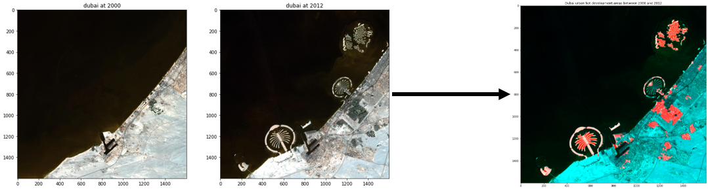

# change-detection-in-urban-areas

---
---

Using temporal satellite imagery, I extract the difference by **clustering** the **principle components** of the difference image and using **connected component analysis** to sort developed areas to focus on the areas that witnessed the most change. 
